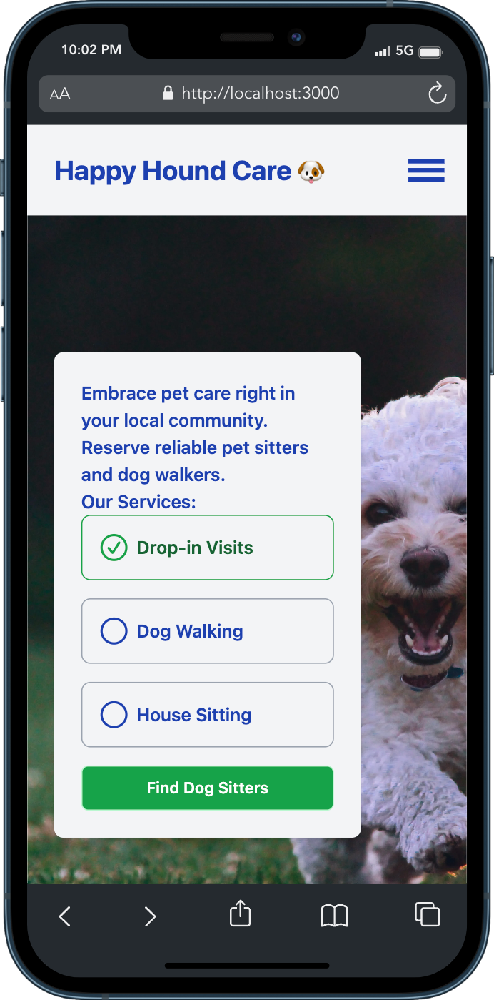
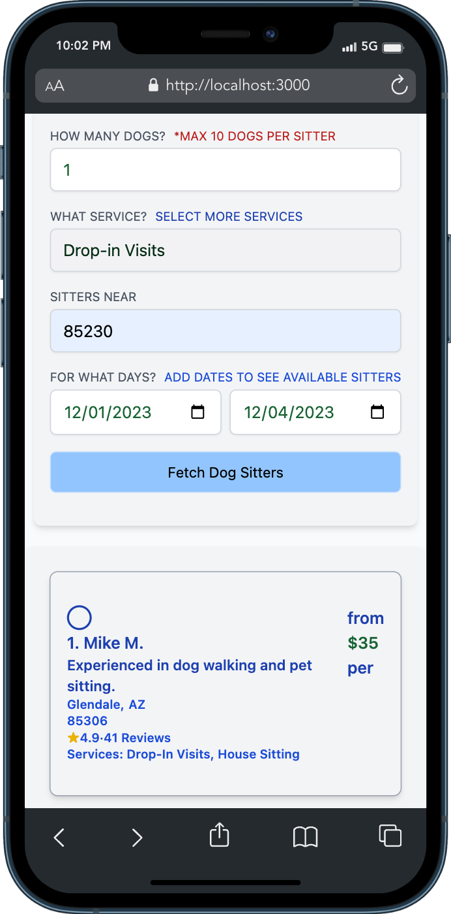
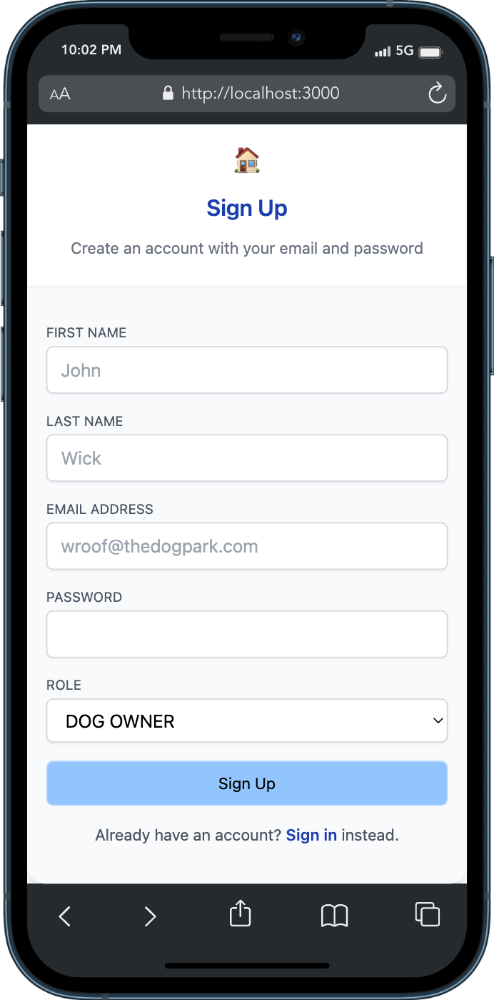
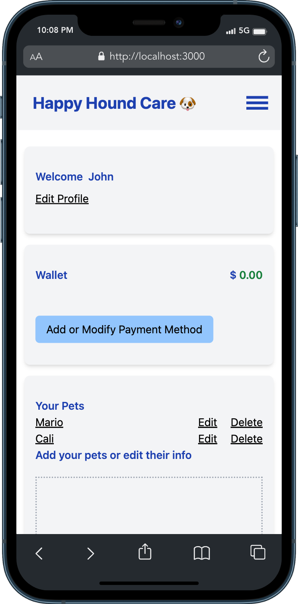
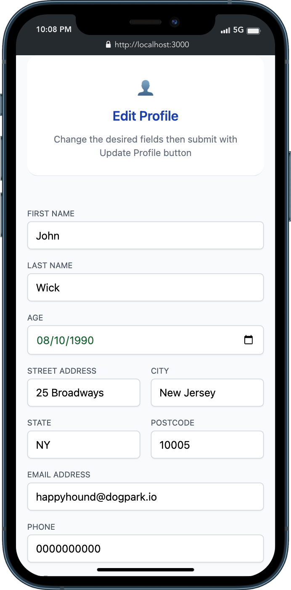
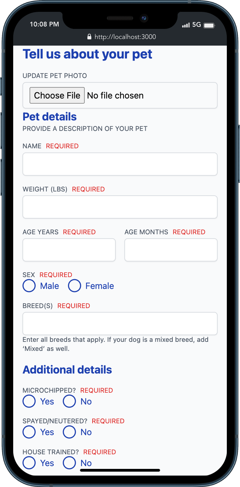

<p align="center">
    <h3 align="center">Built with Next.js Auth GraphQL Prisma PostgreSQL</h3>
</p>

## Landing Page


## Find Dog Sitters


## Create Account


## User Dashboard


## Edit Profile


## Add Pet


## Getting Started

First, install dependancies:
```bash
npm i or npm install
# or
yarn install
```
Second, run your local server:

```bash
npm run dev
# or
yarn start
```

Open [http://localhost:3000](http://localhost:3000) with your browser to see the result.
